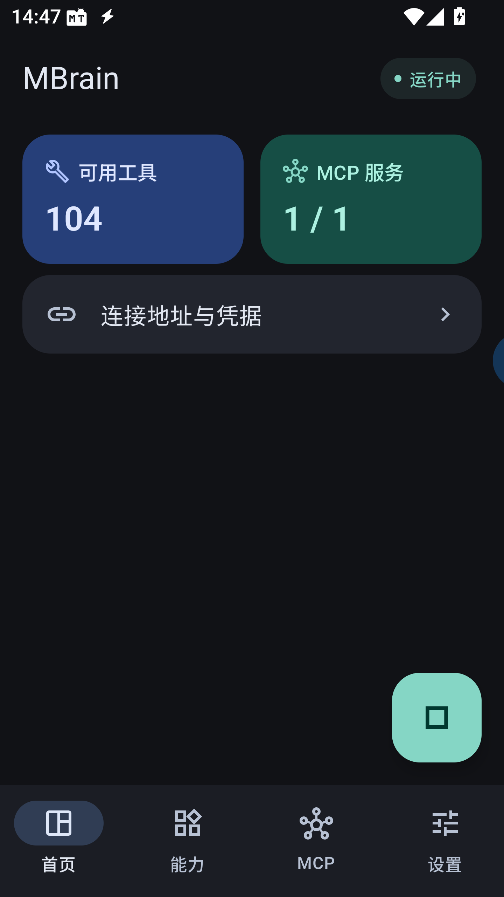
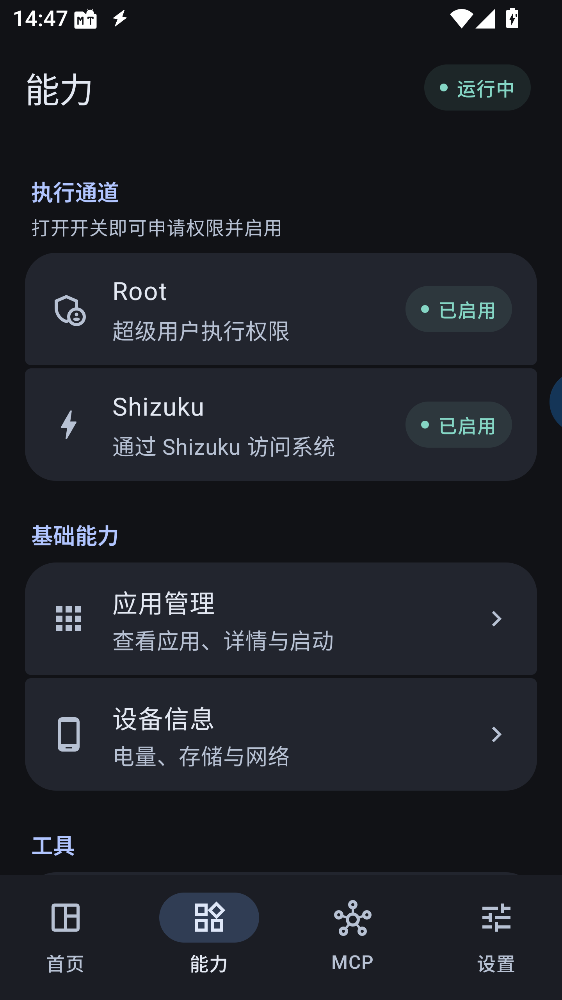
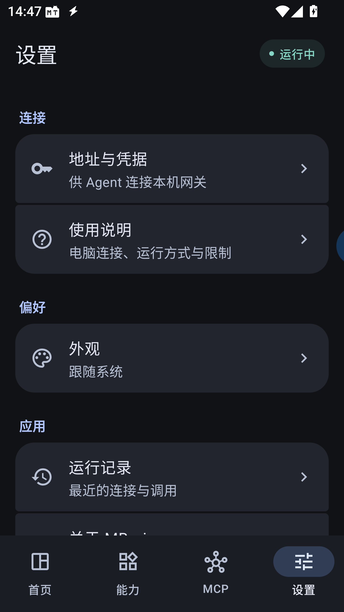

<div align="center">


# MBrain

**让 AI Agent 调用你的 Android 手机能力。**

设备信息 · 应用管理 · 文件操作 · Root / Shizuku · MCP 服务聚合

<p>
  
  
  <a href="https://github.com/powercess/mbrain/releases/latest"></a>
</p>

[快速上手](#快速上手) · [连接 Agent](#连接-agent) · [接入 MCP 服务](#接入-mcp-服务) · [常见问题](#常见问题) · [反馈问题](https://github.com/powercess/mbrain/issues)

</div>

---

MBrain 是运行在 Android 上的 MCP 网关。它把手机自身的能力和你接入的 MCP 服务汇集到一个入口，让支持 MCP 的 AI 客户端读取设备状态、管理应用、操作文件或执行命令。你可以在手机上选择开放哪些能力，并随时停止服务。

## 界面预览

<table>
  <tr>
    <th align="center">首页</th>
    <th align="center">能力管理</th>
    <th align="center">设置</th>
  </tr>
  <tr>
    <td></td>
    <td></td>
    <td></td>
  </tr>
</table>

<sub>应用实际运行截图。可用工具数量取决于已启用能力和接入服务；支持浅色、深色及跟随系统。</sub>

## 可以做什么

| 能力 | 用途 |
| --- | --- |
| **读取设备状态** | 查看设备信息、电量、存储空间和网络状态 |
| **管理应用** | 查看应用列表与详情、启动应用；高权限通道还可安装、卸载和停止应用 |
| **执行命令与操作文件** | 通过 Root 或 Shizuku 执行命令，浏览、读取、写入、复制和移动文件 |
| **接入其他 MCP 服务** | 添加手机本机的 HTTP MCP 服务，或由 MBrain 启动和管理 stdio MCP 进程 |
| **统一管理与连接** | 一个 MCP 地址提供工具目录，支持搜索工具、查看说明、复制连接信息和查看近期运行记录 |
| **内网穿透** | 内置 frpc，统一配置一台服务器，多条基础 TCP 隧道转发 MBrain 或手机其他服务 |

- **按需启用**：Root 和 Shizuku 各用一个开关，打开时自动检查并申请权限。
- **随时停止**：首页右下角一键启停，也可从前台通知停止网关。
- **服务自由添加**：填写自己的服务名称与配置，不绑定特定第三方应用。

## 快速上手

### 1. 安装 MBrain

需要 **Android 9.0 或更高版本**。

从 [GitHub Releases](https://github.com/powercess/mbrain/releases/latest) 下载最新版本的 `mbrain-v版本号-universal.apk`，在 Android 设备上打开并安装。通用安装包覆盖 ARM64、ARM32、x86_64 和 x86，无需挑选架构。

发行页面提供更新说明和 `SHA256SUMS.txt` 校验文件。自行构建及开发测试版说明见[开发指南](docs/development.md)。

### 2. 选择需要开放的能力

打开底部的 **能力** 页面：

- 设备信息不需要 Root。
- 按需启用应用管理。
- 需要高权限操作时，进入 **Root** 或 **Shizuku**，打开启用开关，并完成授权。

使用 Root 需要设备具备 Root 能力，并允许 **MBrain 本身**获取权限。使用 Shizuku 则需先安装并启动 [Shizuku](https://shizuku.rikka.app/)。两种通道可以分别启用，不需要同时开启。

### 3. 启动网关

回到 **首页**，点击右下角的启动按钮。显示“运行中”后，打开 **连接地址与凭据**，获取 MCP 地址和 Bearer Token。

## 连接 Agent

在支持 **HTTP MCP 和 Bearer 认证**的客户端中添加服务：

| 配置项 | 填写内容 |
| --- | --- |
| 名称 | `MBrain`，也可自行命名 |
| MCP 地址 | `http://127.0.0.1:8765/mcp` |
| 认证方式 | Bearer Token |
| Token | 从 MBrain 的“连接地址与凭据”页面复制 |

如果客户端通过请求头配置认证，填写：

```http
Authorization: Bearer <从 MBrain 复制的 Token>
```

**同一台手机上的客户端**可以直接使用上述地址。

**电脑上的客户端**需要先通过 ADB 连接手机，再转发端口：

```bash
adb forward tcp:8765 tcp:8765
```

默认端口被占用时，网关会自动使用空闲端口。请以“连接地址与凭据”中的实际地址及“使用说明”中的 ADB 命令为准。Token 加密保存在设备上，重启后保持不变；可在凭据页重置。

**远程客户端**可在“设置 → 内网穿透”配置一台自建 frps，再添加 TCP 隧道。每条隧道独立启停与重试；MCP 隧道跟随网关，自定义服务隧道独立运行。具体见[内网穿透指南](docs/remote-access.md)。

连接后可以先让 Agent 执行一个简单的只读请求：

> 查看这台手机的电量和剩余存储空间。

> **权限说明**：当前持有 Token 的客户端可以调用全部已启用工具，尚不支持为不同客户端单独分配权限。Root / Shizuku 工具能够执行实际修改，请只连接可信客户端，不要分享 Token。

## 接入 MCP 服务

需要从公网连接时，可进入 **设置 → 内网穿透 → 配置服务器** 填写 frps 地址、端口和 Token。当前仅支持基础 TCP 转发，所有隧道共用一台服务器。配置示例与运行规则见[内网穿透指南](docs/remote-access.md)。

进入 **MCP → 添加服务**，选择连接方式：

| 方式 | 适用情况 | 需要填写 |
| --- | --- | --- |
| **HTTP 服务** | 服务已经由手机上的其他应用或进程启动 | 名称、本机服务地址、可选 Token |
| **托管进程** | 希望由 MBrain 启动并管理 stdio MCP 服务 | 名称、程序、逐项启动参数、执行身份 |

保存配置后，在服务详情中点击 **连接服务**。成功连接后，该服务的工具会加入 MBrain 的工具目录，Agent 可以通过同一个入口调用。

HTTP 服务目前只支持回环地址。托管进程所需的程序和运行环境需要事先在设备上准备好，MBrain 不内置 Node.js 或 Python。

## 常见问题

<details>
<summary><strong>没有 Root，能使用吗？</strong></summary>

可以。设备信息、普通应用查询与启动、本机 HTTP MCP 接入不依赖 Root。需要更高权限时，可以使用 Shizuku；实际操作范围取决于它的启动方式。

</details>

<details>
<summary><strong>为什么客户端连接不上？</strong></summary>

先确认首页显示“运行中”，并使用凭据页中的 Token。电脑连接时还需确认实际端口的 ADB 转发成功。网关仅监听手机回环地址；远程访问通过已配置的 TCP 隧道连接。

</details>

<details>
<summary><strong>为什么找不到某个工具？</strong></summary>

工具数量随能力开关、权限状态和外部服务连接情况变化。先在能力页检查开关，再到 MCP 页检查服务状态，最后在客户端重新获取工具列表。

</details>

<details>
<summary><strong>停止服务后会发生什么？</strong></summary>

网关停止接收请求，断开外部 MCP 连接，并清理直接托管的子进程。应用不会在开机后自动启动网关；运行记录目前仅保留在内存中。

</details>

## 反馈与参与

遇到问题或有功能建议，欢迎通过 [Issue 模板](https://github.com/powercess/mbrain/issues/new/choose)反馈。描述问题时请附上版本和复现步骤；截图或日志中请隐去 Token 与私人信息。

欢迎通过 Pull Request 改进项目。请从默认分支 `dev` 创建功能分支，再提交 PR 到 `dev`；`dev` 和 `main` 均不接受直接推送。发布时由 `dev` 提交 PR 到 `main`，版本 tag 触发正式发布。构建与测试说明见[开发指南](docs/development.md)。

## 致谢

- [droid-mcp](https://github.com/stixez/droid-mcp)：MBrain 使用的 Android MCP 基座，保留其 [Apache-2.0 许可证](vendor/droid-mcp/LICENSE)和[来源记录](vendor/droid-mcp/UPSTREAM.md)。
- [Shizuku](https://github.com/RikkaApps/Shizuku) 与 [libsu](https://github.com/topjohnwu/libsu)：Android 高权限能力接入。
- [RikkaHub](https://github.com/rikkahub/rikkahub)：设置列表与交互设计参考。

## Star History

如果 MBrain 对你有帮助，欢迎点一个 Star。

<picture>
  <source media="(prefers-color-scheme: dark)" srcset="https://api.star-history.com/svg?repos=powercess/mbrain&amp;type=Date&amp;theme=dark" />
  <source media="(prefers-color-scheme: light)" srcset="https://api.star-history.com/svg?repos=powercess/mbrain&amp;type=Date" />
  
</picture>

<sub>Star 趋势由 <a href="https://www.star-history.com/#powercess/mbrain&amp;Date">Star History</a> 提供。</sub>
