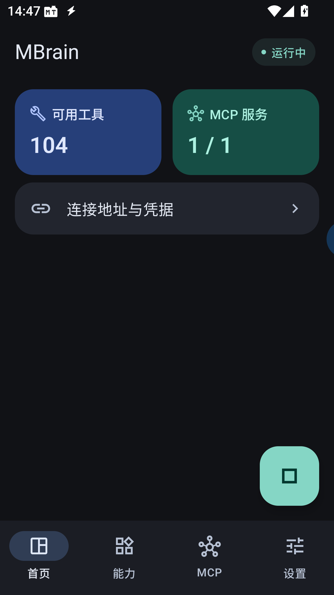
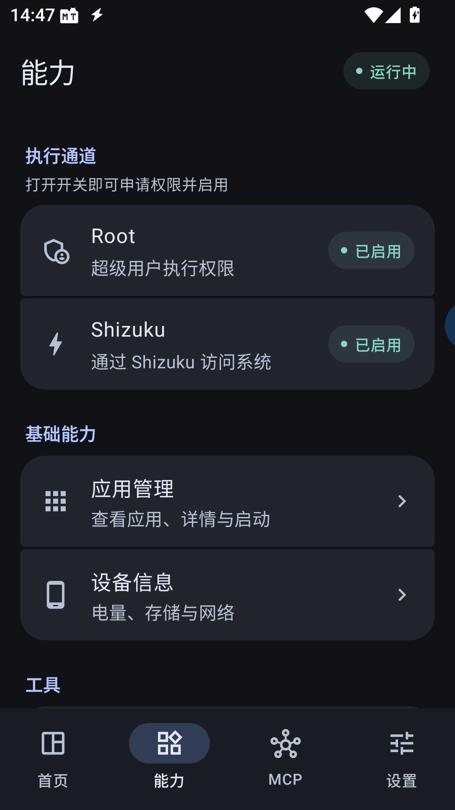
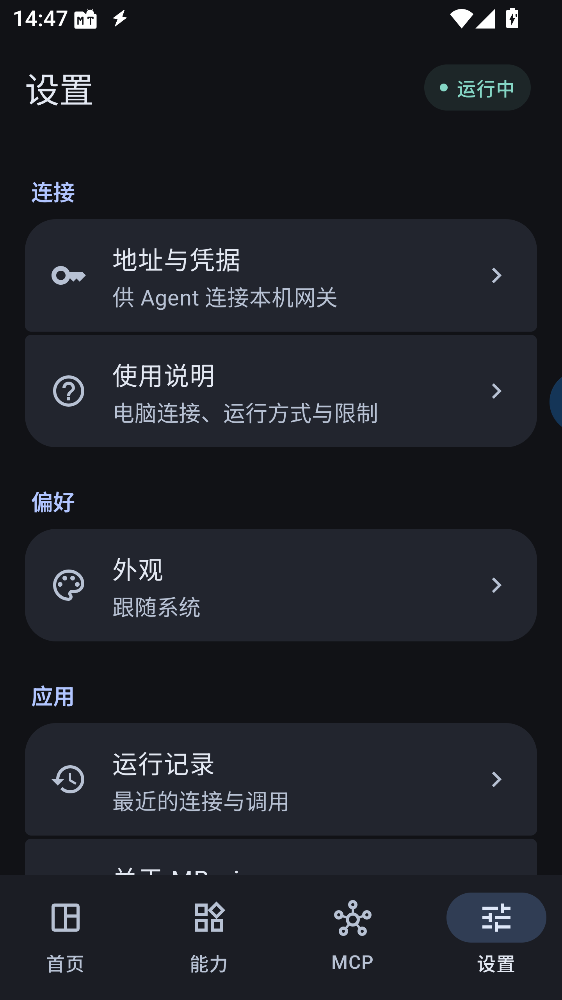

<div align="center">


# MBrain

**An Android MCP gateway for AI agent device control.**

Device information · App management · File operations · Root / Shizuku · MCP service aggregation

<p>
  
  
  <a href="https://github.com/powercess/mbrain/releases/latest"></a>
</p>

[简体中文](README.zh_CN.md) | [繁體中文](README.zh_TW.md) | **English** | [Français](README.fr.md) | [日本語](README.ja.md)

[Quick start](#quick-start) · [Connect an agent](#connect-an-ai-agent) · [Add MCP services](#add-mcp-services) · [FAQ](#faq) · [Report an issue](https://github.com/powercess/mbrain/issues)

</div>

---

MBrain is an Android gateway for the Model Context Protocol (MCP) that lets AI agents access device information, manage apps, operate files, execute commands, and connect to additional MCP services through one unified endpoint. Enable only the capabilities you need and stop the gateway at any time.

## Screenshots

<table>
  <tr>
    <th align="center">Home</th>
    <th align="center">Capabilities</th>
    <th align="center">Settings</th>
  </tr>
  <tr>
    <td></td>
    <td></td>
    <td></td>
  </tr>
</table>

<sub>Screenshots from the running app. Available tools depend on enabled capabilities and connected services. Light, dark, and system themes are supported.</sub>

## Features

| Capability | What it provides |
| --- | --- |
| **Device information** | Read device details, battery, storage, and network status |
| **App management** | List, inspect, and launch apps; privileged channels can also install, uninstall, and stop apps |
| **Commands and files** | Run commands through Root or Shizuku and browse, read, write, copy, or move files |
| **MCP service aggregation** | Add local HTTP MCP services or let MBrain manage stdio MCP processes |
| **One endpoint** | Expose one searchable tool catalog with connection details and recent run history |
| **Remote access** | Use the built-in frpc client to forward MBrain or other phone services through TCP tunnels |

- **Opt-in capabilities:** Root and Shizuku have separate switches and permission checks.
- **One-tap control:** Start or stop the gateway from Home or the foreground notification.
- **Bring your own services:** Add service names and configurations without being tied to a specific third-party app.

## Quick start

### 1. Install MBrain

Requires **Android 9.0 or later**.

Download the latest `mbrain-v<version>-universal.apk` from [GitHub Releases](https://github.com/powercess/mbrain/releases/latest) and install it on your Android device. The universal APK supports ARM64, ARM32, x86_64, and x86.

Releases include notes and a `SHA256SUMS.txt` checksum file. See the [development guide](docs/development.md) for local builds and development variants.

### 2. Choose capabilities

Open the **Capabilities** tab:

- Device information does not require Root.
- Enable app management when needed.
- For privileged operations, enable **Root** or **Shizuku** and complete authorization.

Root requires a rooted device and permission granted to **MBrain itself**. Shizuku requires [Shizuku](https://shizuku.rikka.app/) to be installed and running. The two channels can be enabled independently.

### 3. Start the gateway

Return to **Home**, tap the start button, then open **Connection details and credentials** to copy the MCP URL and Bearer token.

## Connect an AI agent

Add MBrain to a client that supports **HTTP MCP and Bearer authentication**:

| Setting | Value |
| --- | --- |
| Name | `MBrain`, or a name of your choice |
| MCP URL | `http://127.0.0.1:8765/mcp` |
| Authentication | Bearer token |
| Token | Copy from the app's connection credentials page |

For clients configured through request headers:

```http
Authorization: Bearer <your-token>
```

**Clients on the same phone** can use the URL directly. **Desktop clients** need an ADB connection and port forwarding:

```bash
adb forward tcp:8765 tcp:8765
```

If the default port is occupied, MBrain chooses an available port. Use the actual URL and ADB command shown in the app. The token is encrypted on the device, persists across restarts, and can be reset from the credentials page.

Try a simple read-only request:

> Check this phone's battery level and available storage.

## Add MCP services

Open **MCP → Add service** and choose a connection type:

| Type | Use case | Configuration |
| --- | --- | --- |
| **HTTP service** | Another app or process already runs the service on the phone | Name, local URL, optional token |
| **Managed process** | MBrain starts and manages a stdio MCP process | Name, executable, individual arguments, execution identity |

Save the configuration and select **Connect service** in its details. Connected tools join the gateway's catalog and are available through the same MCP endpoint.

HTTP services currently require loopback addresses. Prepare executables and runtimes on the device before adding managed processes; MBrain does not bundle Node.js or Python.

## Remote access

The built-in **frpc** client can forward MBrain or other phone services through a self-hosted **frps** server. Open **Settings → Remote access → Configure server**, enter the server address, port, and token, then add TCP tunnels.

All tunnels share one server configuration. Each tunnel has independent start, stop, and retry controls. MCP tunnels follow the gateway lifecycle; custom service tunnels run independently. Only basic TCP forwarding is supported. See the [remote access guide](docs/remote-access.md) (Simplified Chinese) for configuration and operating rules.

## Permissions and security

- The gateway listens only on the phone's loopback interface. Desktop access uses ADB forwarding; remote access uses configured tunnels.
- Any client with the Bearer token can call **all enabled tools**. Per-client permissions are not currently supported.
- Root and Shizuku tools can make real changes to the device. Connect trusted clients and keep the token private.
- Choose capabilities on the phone and stop the gateway whenever access is no longer needed.

## FAQ

<details>
<summary><strong>Can I use MBrain without Root?</strong></summary>

Yes. Device information, ordinary app queries and launching, and local HTTP MCP services do not require Root. Shizuku provides another channel for privileged operations; its capabilities depend on how it was started.

</details>

<details>
<summary><strong>Why can't my client connect?</strong></summary>

Check that the gateway is running and the token matches the credentials page. For desktop access, verify ADB forwarding for the actual port. The gateway listens only on loopback; remote connections require a configured TCP tunnel.

</details>

<details>
<summary><strong>Why is a tool missing?</strong></summary>

Available tools depend on capability switches, permissions, and external service connections. Check Capabilities and MCP service status, then refresh the tool list in your client.

</details>

<details>
<summary><strong>What happens when I stop the gateway?</strong></summary>

MBrain stops accepting requests, disconnects external MCP services, and cleans up directly managed child processes. It does not automatically start the gateway at boot. Run history is currently kept only in memory.

</details>

## Contributing

Bug reports, feature suggestions, documentation improvements, and code contributions are welcome. Use the [issue templates](https://github.com/powercess/mbrain/issues/new/choose) and include the app version and reproduction steps. Remove tokens and private information from screenshots and logs.

Read the [contributing guide](CONTRIBUTING.md) for setup, building, validation, and the pull request workflow. Start from the latest `dev` on a dedicated branch and target `dev` in your pull request. The [development guide](docs/development.md) (Simplified Chinese) covers device testing.

## Acknowledgements

- [droid-mcp](https://github.com/stixez/droid-mcp): the Android MCP foundation used by MBrain, with its [Apache-2.0 license](vendor/droid-mcp/LICENSE) and [upstream record](vendor/droid-mcp/UPSTREAM.md) retained.
- [Shizuku](https://github.com/RikkaApps/Shizuku) and [libsu](https://github.com/topjohnwu/libsu): Android privileged access.
- [RikkaHub](https://github.com/rikkahub/rikkahub): settings list and interaction design reference.

## Star History

If MBrain is useful to you, consider giving it a star.

<picture>
  <source media="(prefers-color-scheme: dark)" srcset="https://api.star-history.com/svg?repos=powercess/mbrain&amp;type=Date&amp;theme=dark" />
  <source media="(prefers-color-scheme: light)" srcset="https://api.star-history.com/svg?repos=powercess/mbrain&amp;type=Date" />
  
</picture>

<sub>Chart provided by <a href="https://www.star-history.com/#powercess/mbrain&amp;Date">Star History</a>.</sub>
