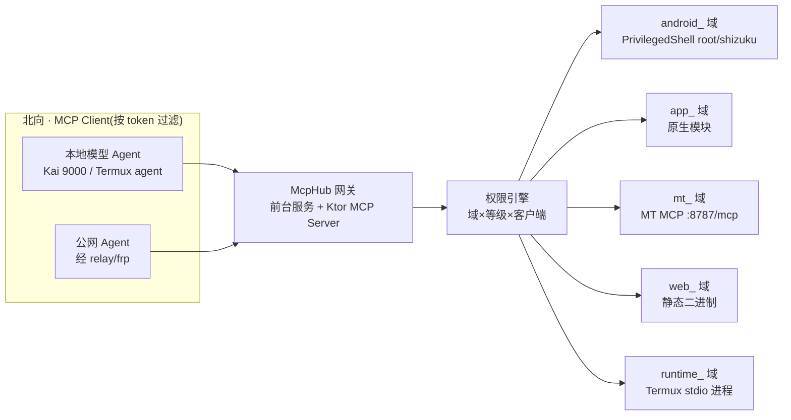

# McpHub — 手机 AI 能力网关 · 需求规格

> 版本:v1.0 · 日期:2026-09-16 · 状态:需求整理(待评审)
> 本文件是给另一个 AI agent 的需求交接文档,基于前期方案讨论整理。

---

## 1. 项目定位

**McpHub 是一个运行在 Android 手机上的工具类 App,作为"AI 调用手机能力的 MCP 中转节点"**:

- **南向**:聚合接入 root 能力、Shizuku 能力、MT 管理器 MCP 能力、stdio 本地 MCP 能力四大能力源;
- **北向**:以 MCP Server(Streamable HTTP)对外提供统一工具接口,供手机内的本地模型 / Agent 客户端调用;
- **定位差异**:现有项目(MCPShell、shizuku-mcp、droid-mcp 等)各有单点能力,但**没有"四源聚合 + 多客户端权限矩阵 + 可 7×24 公网"的完整形态**,这是本项目的增量价值。

## 2. 目标与非目标

### 2.1 目标

1. 手机内自闭环:本地模型 Agent(如 Kai 9000、Termux agent)通过 localhost 连接网关,调用手机系统能力;
2. 能力聚合:root / Shizuku / MT MCP / stdio MCP 四类能力源统一注册、统一暴露;
3. 权限可控:多客户端(每个 Agent 独立 Token)按"能力域 × 安全等级"授权,高危操作确认,全量审计;
4. 长期运行:前台服务保活,可 7×24 不间断;
5. 公网可选:通过 frp 或 relay 架构,向公网 Agent 提供调用能力(默认关闭)。

### 2.2 非目标

- 不做手机 GUI 自动化框架(无障碍点击等作为可选模块,非 P0);
- 不内置 Node.js/Python 运行时(stdio 依赖 Termux 或静态二进制);
- 不做云服务,所有数据与调用留在本机(公网形态仅作传输通道)。

## 3. 用户场景

| 场景 | 描述 |
|---|---|
| S1 本地 Agent 闭环 | 手机内跑本地模型 Agent,连 `127.0.0.1:<port>/mcp`,让 AI 执行 `pm`、`input`、读文件、查日历等操作 |
| S2 高权限运维 | 设备有 root:Agent 通过网关执行任意 shell、读 `/data`、装/卸应用 |
| S3 免 root 运维 | 设备无 root:经 Shizuku(ADB 级权限)执行系统操作 |
| S4 文件/APK 处理 | 经 MT 管理器 MCP(文件管理、APK 逆向) |
| S5 自定义脚本 | 用户配置 Termux 里的 stdio MCP server(node/python 脚本),网关拉起并代理 |
| S6 公网远程 | 可选:frp 或 relay 架构,让公网 Agent 远程调用手机能力 |

## 4. 功能需求

### 4.1 北向接口(网关对外)

- **MCP Server**:实现 Streamable HTTP 传输(按 MCP 当前规范,支持批量请求与通知流);
- **默认绑定 `127.0.0.1`**,局域网绑定(LAN 模式)为可选开关;
- **多客户端**:每个客户端独立 Bearer Token;`tools/list` 按客户端授权过滤工具列表(schema 裁剪,适配本地弱模型小上下文);
- 可选:OpenAI 兼容 `/v1/chat/completions` + tools 面(给不会 MCP 的自研 Agent 循环用,非 P0)。

### 4.2 南向能力源(四大适配器)

| 能力源 | 实现 | 工具示例 |
|---|---|---|
| Root | libsu(topjohnwu)保活交互式 shell | `android_shell_exec`、`android_pm_install`、全盘读写 |
| Shizuku | rikka Shizuku API(binder + RuntimeShell) | 同上工具面,后端为 shell-UID;auto 模式 root→shizuku 降级 |
| MT MCP | 网关作为 MCP client 连 `http://127.0.0.1:8787/mcp`(Streamable HTTP,Bearer Token 可选) | `mt_fs_read`、`mt_apk_analyze` 等透传工具 |
| stdio MCP | 网关 spawn 子进程,stdin/stdout 逐行 JSON-RPC;进程生命周期管理 | `runtime_python`、`runtime_node_script` 等,或内置静态二进制工具 |

### 4.3 权限引擎(核心模块)

- **授权模型**:客户端 × (能力域 × 安全等级) 授权矩阵;支持 auto(放行)/ confirm(确认)/ strict(拦截)三档策略;
- **高危清单**:`rm -rf`、`dd`、`pm uninstall/clear`、改 `/system` 等默认拦截或确认;
- **审计日志**:全量落 SQLite(Room),按能力域归档,可导出;
- **一键 kill switch**:App 内随时关闭全部对外服务。

### 4.4 能力分类(架构一等公民)

按 **能力域 × 安全等级 × 客户端可见性** 三维组织:

| 域 | 前缀 | 来源 | 示例 | 安全等级 |
|---|---|---|---|---|
| 安卓系统 | `android_` | root/Shizuku | shell_exec、pm_install、input_tap、screencap | L2-L3 高危 |
| 安卓应用 | `app_` | 原生模块(droid-mcp 系) | calendar_read、sms_send、notification_list | L1 隐私 |
| 文件/APK | `mt_` | MT MCP | fs_read、apk_analyze | L1-L2 |
| 外部网络 | `web_` | 内置静态二进制 server | fetch、search、api_call | L0-L1 |
| 计算/脚本 | `runtime_` | Termux stdio / 静态二进制 | python、sql_query | L1-L2 |
| 设备信息 | `device_` | 原生只读 | battery、wifi、location | L0 只读 |

安全等级策略:

```
L0 只读查询     → auto 放行
L1 写本地/隐私 → 首次确认后记住
L2 系统操作    → 每次确认或白名单化
L3 root 级     → 默认拒绝,显式开启 + 高危清单
```

### 4.5 运行形态

- **前台服务**保活,`foregroundServiceType=specialUse`(Android 15 对 dataSync 有 6 小时时限,specialUse 无时限);
- 电池优化豁免 + OEM 厂商白名单引导页(MIUI/ColorOS/OriginOS 后台限制);
- stdio 子进程崩溃自动重启(指数退避),超时与输出预算管理(截断,防爆本地模型上下文)。

### 4.6 公网形态(可选,P3)

- 首选:**
outbound relay 架构**(参考 rish-mcp:手机 App 主动 WebSocket 连自建 relay,公网 Agent 连 relay 的 MCP 端点;手机零入站端口);
- 备选:frp + frps(需公网 VPS),frp 仅作传输通道,认证仍走网关 Bearer Token;
- 更优替代:Tailscale / ZeroTier 组网(免开放端口),frp stcp 点对点模式。

## 5. 技术栈(已定)

| 层 | 选型 |
|---|---|
| 语言/UI | Kotlin + Jetpack Compose (M3) |
| 基座 | **二改 [droid-mcp](https://github.com/stixez/droid-mcp)**(Apache-2.0,Kotlin SDK,root/shizuku 模块现成,145 工具可裁剪) |
| MCP Server | Ktor 3 + kotlinx.serialization **手写**最小 server 层(官方 Java SDK 是 Spring 系,Android 不兼容) |
| Root | libsu |
| Shizuku | dev.rikka.shizuku:api |
| stdio 进程 | ProcessBuilder + coroutines |
| 存储 | Room(SQLite)审计/授权 + DataStore 配置 |
| 兼容 | minSdk 26+(基座 28),targetSdk 34/35,arm64-v8a |

参考项目:
- [MCPShell](https://github.com/xnet-admin-1/mcpshell)(AGPL-3.0,现成 App:sh/proot/rish,无权限矩阵)——验证形态
- [shizuku-mcp](https://github.com/shizzgar/shizuku-mcp)(Termux + rish + Python MCP server)
- [rish-mcp](https://github.com/turin-dev/rish-mcp)(relay 架构,MIT)
- [Zafiro](https://github.com/niki914/zafiro)(权限协调器 ShellCommandSafetyPolicy 可参考)
- [mtiutin/mcp-bridge](https://github.com/mtiutin/mcp-bridge)(stdio↔HTTP 桥,接 MT MCP 用)
- [deuriib/mcp-gateway](https://github.com/deuriib/mcp-gateway)(Code Mode,schema 压缩 92%,适配弱模型)
- [openziti/mcp-gateway](https://github.com/openziti/mcp-gateway)(零信任、每客户端隔离、工具过滤)

## 6. 架构



## 7. 里程碑

| 阶段 | 内容 | 验证 |
|---|---|---|
| P0 | 工程骨架 + 前台服务 + Ktor MCP Server + Token 认证 + root 适配器 | Termux curl 实测 tools/call |
| P1 | Shizuku 适配器(PrivilegedShell 统一接口 + auto 降级)、权限引擎、审计、控制台 UI | 真机 Kai 9000 闭环 |
| P2 | stdio 运行器(bundled 静态二进制 → Termux 提权 exec)、MT MCP 客户端适配器 | 四源聚合跑通 |
| P3 | 公网形态(relay/frp)、OpenAI 兼容面、schema 裁剪、告警与导出 | 公网 Agent 远程调用 |

## 8. 关键约束与风险

1. **安全红线**:能执行 root 命令的 MCP server 是攻击面;默认拒、localhost-only、每客户端独立 token、全量审计、一键 kill switch;
2. **保活是工程问题**:前台服务 + 电池豁免 + OEM 白名单三层缺一不可;Android 15 前台服务类型限制;
3. **stdio 运行时**:优先内置 Go/Rust 静态二进制(零依赖);Termux 生态经提权 exec 或桥接 HTTP;别内置 Node(100MB+);
4. **本地弱模型上下文**:tools/list 必须按客户端裁剪 + 输出截断;
5. **许可证**:基座 droid-mcp 为 Apache-2.0(二改友好);MCPShell 为 AGPL-3.0(仅参考,不并入)。

## 9. 开放问题(待评审)

1. 消费端具体是哪些本地模型 App?(决定是否需要 OpenAI 兼容面)
2. 目标设备是否已 root?(决定 PrivilegedShell 默认后端与 L3 策略)
3. 公网形态首期是否要做?(决定 P3 优先级)
4. MT MCP 需要透传全部工具还是子集?(MT v2.26.9 起支持 Bearer Token)
5. 是否上架应用市场?(specialUse 前台服务类型在 Play 需声明理由;国内商店渠道另论)
